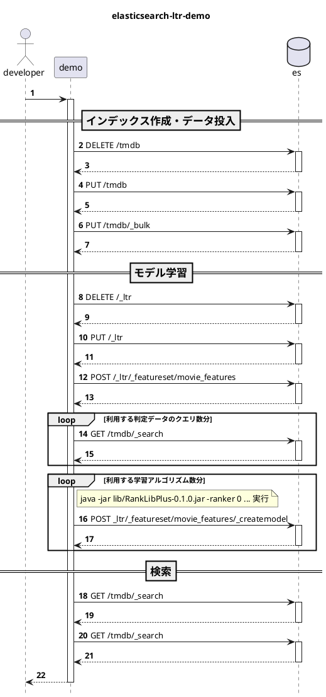

# Demo for elasticsearch learning-to-rank

[Elasticsearch LTR](https://github.com/o19s/elasticsearch-learning-to-rank)を試すためのデモ用のソースコードです。

# デモ概要

titleとoverviewフィールドに対して検索した結果をElasticsearch LTRプラグインを用いてリランクします。
そのためのモデル作成やElasticsearchへのモデルアップロードも行います。

このデモを進める前に公式ドキュメントを見ておくと理解がより進むと思います。

* [コアコンセプト](https://github.com/o19s/elasticsearch-learning-to-rank/blob/main/docs/core-concepts.rst)
* [Elasticsearch LTR基本機能](https://github.com/o19s/elasticsearch-learning-to-rank/blob/main/docs/building-features.rst)
* [特徴量ロギング](https://github.com/o19s/elasticsearch-learning-to-rank/blob/main/docs/logging-features.rst)
* [ranklibでの学習](https://github.com/o19s/elasticsearch-learning-to-rank/blob/main/docs/training-models.rst)
* [検索](https://github.com/o19s/elasticsearch-learning-to-rank/blob/main/docs/searching-with-your-model.rst)


# 事前準備：データとライブラリ

検索データとランキング学習用のライブラリをダウンロードして、所定の位置に配置します。

* 検索データ
  * [TMDB](https://www.themoviedb.org/?language=ja)の映画データ(tmdb.json)を利用
  * app/demo/data/index配下にtmdb.jsonを配置
* ランキング学習用のライブラリ
  * [RankLibPlus](https://github.com/Snagajob/RankLibPlus)を利用
  * app/demo/lib配下にRankLibPlus-0.1.0.jarを配置

以下シェルスクリプトを実行することでダウンロード、配置することが出来ます。

```shell
$ bash prepare.sh
```

# 事前準備：Elasticsearchコンテナ起動

デモ用スクリプトを実行する前に以下コマンドを実行してElasticsearch用のコンテナを起動して下さい。
このデモで利用するElasticsearchのバージョンは7.17系を利用します。

```shell
$ docker-compose up -d es
```

コンテナを起動するためにDockerイメージを作成するのですが、このタイミングで[Elasticsearch LTR](https://github.com/o19s/elasticsearch-learning-to-rank)プラグインをインストールします。

```shell
FROM docker.elastic.co/elasticsearch/elasticsearch:7.17.9

RUN bin/elasticsearch-plugin install -b https://github.com/o19s/elasticsearch-learning-to-rank/releases/download/v1.5.8-es7.17.7/ltr-plugin-v1.5.8-es7.17.7.zip
```


# 事前準備：実行環境のセットアップ

### Python用仮想環境のセットアップ

＜Mac環境の場合＞

ここではPoetryのセットアップが済んでいるものとして進めます。
以下コマンドを実行して、このプロジェクト用の仮想環境のセットアップを行います。

```shell
$ cd es-ltr-demo/app
$ poetry install
```

### 環境変数設定

デモ用スクリプトを動かすために必要な環境変数設定を行います。


```shell
$ export ES_HOST=localhost
$ export ES_PORT=9200
$ export APP_DIR_BASE=../../..
```

# デモ用スクリプトの実行

実行方法には以下の2通りの方法があります。
それぞれの実行で行われる処理は以下となります。

* インデックス作成・データ投入
* モデル学習
* 検索

この中の「モデル学習」ではElasticsearch LTR用の操作など複数の操作を行っています。ここに関しては、後ほど細かくstepに分けて説明したいと思います。


## ▼runスクリプトを実行する方法

run.shを実行してデモを実行します。

```shell
$ cd es-ltr-demo/app
$ poetry run bash run.sh
```

## ▼Pythonスクリプトを1つ1つ実行していく方法

これらのPythonスクリプトはrun.shで実行されているファイル群となります。

```shell
$ cd es-ltr-demo/app/demo
$ poetry run python index_tmdb.py
$ poetry run python train.py
$ poetry run python check_search_results.py --keyword Rocky
```


# 詳細

## 1. インデックス作成・データ投入

まず、インデックスを削除して再度作成して、データを投入します。デモ用なので、1から作り直すようになっています。
index_tmdb.pyの主な処理内容や実行コマンドは以下となります。

* インデックス削除
* インデックス作成（mapping設定あり）
* データ投入（bulkリクエスト）

実行コマンド

```shell
$ poetry run python index_tmdb.py
```

これにより、Elasticsearchにtmdbインデックスが作成されデータが入った状態となります。


## 2. モデル学習

続いて、モデル学習で行っている以下の内容について説明します。

1. 特徴量セットのセットアップ
2. 判定データへの特徴量付加
3. 学習モデルの作成とアップロード

実行コマンドは以下となります。

```shell
$ poetry run python train.py
```

RankLibPlusでは10つの学習アルゴリズムがサポートされています。
ここではそれぞれの学習アルゴリズムで学習を行いモデルを作成します。（作成されるモデルは計10つ）

* ref. [RankLib Usage](https://sourceforge.net/p/lemur/wiki/RankLib%20How%20to%20use/)

```
0: MART (Multiple Additive Regression Trees, a.k.a. Gradient boosted regression tree)
1: RankNet
2: RankBoost
3: AdaRank
4: coord Ascent
6: LambdaMART
7: ListNET
8: Random Forests
9: Linear Regression
```

モデルタイプを指定して特定の1つの学習アルゴリズムで学習したモデルのみ作成することも出来るようになっています。

```shell
$ poetry run python train.py --model-type 4
```


<br><br>
ここからモデル学習の処理内容に入っていきます。


### 2.1 特徴量セットのセットアップ

最初にfeature store初期化の初期化と特徴量セットの定義を行ってセットアップを行います。

##### 2.1.1 default feature store初期化
* Elasticsearchに `DELETE /_ltr` , `PUT /_ltr` をリクエストして初期化を行う
* これもインデックス同様デモ用のため毎回削除して作り直している

##### 2.1.2 Elasticsearchで計算する特徴量セット定義
* リクエストボディにfeaturesetを指定して `POST /_ltr/_featureset/movie_features` リクエストを行う
* デモで用いる特徴量は以下2つ（template部分が特徴量抽出用クエリに該当）
    1. クエリとtitleフィールドの値とのマッチ度
    2. クエリとoverviewフィールドの値とのマッチ度

```json
POST /_ltr/_featureset/movie_features
{
  "featureset": {
    "name": "movie_features",
    "features": [
      {
        "name": "1",
        "params": [
          "keywords"
        ],
        "template": {
          "match": {
            "title": "{{keywords}}"
          }
        }
      },
      {
        "name": "2",
        "params": [
          "keywords"
        ],
        "template": {
          "match": {
            "overview": "{{keywords}}"
          }
        }
      }
    ]
  }
}
```

### 2.2 判定データ（評価データ、正解データ）への特徴量付加

次に判定データを読み込んで、判定データに対して特徴量を付加します。


##### 2.2.1 クエリID(qid)毎の判定データのロード
* 以下内容の `./data/judgment/sample_judgments.txt` を読み込む
  * このファイルは開発者などが事前に用意するデータ
  * ここではクエリID(qid)とドキュメントID(docId)がどれくらい一致しているかをgradeで評価している
  * タイトルもあるがここでは利用しない（docIdだけだと分からないためその補足情報）

```
# qid keyword
# qid:1: rambo
# qid:2: rocky
# qid:3: bullwinkle
#
# grade (0-4)	queryid	docId	title
4	qid:1 #	7555	Rambo
3	qid:1 #	1370	Rambo III
3	qid:1 #	1369	Rambo: First Blood Part II
3	qid:1 #	1368	First Blood
0	qid:1 #	136278	Blood
0	qid:1 #	102947	First Daughter
0	qid:1 #	13969	First Daughter
0	qid:1 #	61645	First Love
0	qid:1 #	14423	First Sunday
0	qid:1 #	54156	First Desires
4	qid:2 #	1366	Rocky
・・・
```

##### 2.2.2 Elasticsearchから取得した各ドキュメントの特徴量ログをリスト形式に変換した後、判定データの特徴量として保存する
* デモで利用する特徴量ログ抽出用のElasticsearchリクエストとレスポンスの該当箇所は以下
* sltrクエリで抽出用の特徴量セットと利用するパラメータを指定
  * sltrは以下の意
    * > sltr query : build a ltr query based on a stored model.
    * [StoredLtrQueryBuilder.java](https://github.com/o19s/elasticsearch-learning-to-rank/blob/6dbd7ff514f4e75bdca5c78364e46ecd68d85584/src/main/java/com/o19s/es/ltr/query/StoredLtrQueryBuilder.java#L47)
* また `ext` を指定することで、レスポンスの各ドキュメントにlog_entry1という名前で計算済みの特徴量スコアが返却されるようになる

＜Elasticsearchリクエスト＞

```json
POST /tmdb/_search
{
  "size": 100,
  "query": {
    "bool": {
      "filter": [
        {
          "terms": {
            "_id": [
              "7555",
              "1370",
              "1369",
              "1368",
              "136278",
              "102947",
              "13969",
              "61645",
              "14423",
              "54156"
            ]
          }
        }
      ],
      "should": [
        {
          "sltr": {
            "_name": "logged_featureset",
            "featureset": "movie_features",
            "params": {
              "keywords": "rambo"
            }
          }
        }
      ]
    }
  },
  "ext": {
    "ltr_log": {
      "log_specs": {
        "name": "log_entry1",
        "named_query": "logged_featureset",
        "missing_as_zero": true
      }
    }
  }
}
```

＜Elasticsearchレスポンス＞

* レスポンスの各ドキュメントには `_ltrlog` フィールドがあり、その中に計算済みの特徴量スコアが含まれていることが確認出来る

```json
・・・
    "hits": [
      {
        "_index": "tmdb",
        "_type": "_doc",
        "_id": "7555",
        "_score": 22.892391,
        "_ignored": [
          "overview.keyword"
        ],
        "_source": {
          "id": 7555,
          "title": "Rambo",
・・・
          "original_title": "Rambo",
          "overview": "When governments fail to act on behalf of captive missionaries, ex-Green Beret John James Rambo sets aside his peaceful existence along the Salween River in a war-torn region of Thailand to take action.  Although he's still haunted by violent memories of his time as a U.S. soldier during the Vietnam War, Rambo can hardly turn his back on the aid workers who so desperately need his help.",
          "adult": false,
・・・
          "imdb_id": "tt0133093",
          "revenue": 463517383,
          "homepage": "http://www.warnerbros.com/matrix"
        },
        "fields": {
          "_ltrlog": [
            {
              "log_entry1": [
                {
                  "name": "1",
                  "value": 10.357876
                },
                {
                  "name": "2",
                  "value": 9.894461
                }
              ]
            }
          ]
        },
        "matched_queries": [
          "logged_featureset"
        ]
      },
      {
        "_index": "tmdb",
        "_type": "_doc",
        "_id": "604",
        "_score": 18.287449,
・・・
```


本番環境で利用するためのライブ特徴量セットロギングのTipsもこちらに記載があるので、利用予定がある場合は要参照

* https://github.com/o19s/elasticsearch-learning-to-rank/blob/main/docs/logging-features.rst#logging-values-for-a-live-feature-set


##### 2.2.3 特徴量が付加された判定データをファイルに書き出す
* `./data/judgment/sample_judgments_wfeatures.txt` に [ranklib_format](https://sourceforge.net/p/lemur/wiki/RankLib%20File%20Format/) の形式で書き出す
* ここでは10ドキュメントの特徴量しか利用していないですが、多い方が精度は高くなる傾向にある

```bash
4	qid:1	1:12.318474	2:10.573917 # 7555	rambo
3	qid:1	1:10.357876	2:11.95039 # 1370	rambo
3	qid:1	1:7.0105133	2:11.220095 # 1369	rambo
3	qid:1	1:0.0	2:11.220095 # 1368	rambo
0	qid:1	1:0.0	2:0.0 # 136278	rambo
0	qid:1	1:0.0	2:0.0 # 102947	rambo
0	qid:1	1:0.0	2:0.0 # 13969	rambo
0	qid:1	1:0.0	2:0.0 # 61645	rambo
0	qid:1	1:0.0	2:0.0 # 14423	rambo
0	qid:1	1:0.0	2:0.0 # 54156	rambo
4	qid:2	1:10.686391	2:8.814846 # 1366	rocky
・・・
```

## 2.3 学習モデルの作成とアップロード

##### 2.3.1 ランキング学習ライブラリranklibでモデル学習を行う
* Pythonから外部コマンドで以下Javaコマンドを実行してモデルを作成する
  * `sample_judgments_wfeatures.txt` を入力として与えて、モデルの内容を  `model.txt` に書き出す

```shell
$ java -jar lib/RankLibPlus-0.1.0.jar -ranker 6 -train ./data/judgment/sample_judgments_wfeatures.txt -save ./data/model/model.txt -frate 1.0
```

* 出力されたモデルの内容は以下

```xml
## LambdaMART
## No. of trees = 1000
## No. of leaves = 10
## No. of threshold candidates = 256
## Learning rate = 0.1
## Stop early = 100

<ensemble>
	<tree id="1" weight="0.1">
		<split>
			<feature> 1 </feature>
			<threshold> 10.357876 </threshold>
			<split pos="left">
				<feature> 2 </feature>
				<threshold> 11.95039 </threshold>
				<split pos="left">
					<feature> 1 </feature>
					<threshold> 8.985554 </threshold>
					<split pos="left">
						<feature> 1 </feature>
						<threshold> 6.815921 </threshold>
						<split pos="left">
							<feature> 2 </feature>
							<threshold> 9.806382 </threshold>
							<split pos="left">
								<feature> 1 </feature>
								<threshold> 0.0 </threshold>
								<split pos="left">
									<feature> 2 </feature>
									<threshold> 0.0 </threshold>
									<split pos="left">
										<output> -2.0 </output>
									</split>
									<split pos="right">
										<output> -2.0 </output>
									</split>
								</split>
								<split pos="right">
									<output> -2.0 </output>
								</split>
							</split>
							<split pos="right">
								<output> -1.9654380083084106 </output>
							</split>
						</split>
						<split pos="right">
							<output> -1.8841131925582886 </output>
						</split>
					</split>
					<split pos="right">
						<feature> 2 </feature>
						<threshold> 9.894461 </threshold>
						<split pos="left">
							<output> 2.0 </output>
						</split>
						<split pos="right">
							<output> -1.3555747270584106 </output>
						</split>
					</split>
				</split>
				<split pos="right">
					<output> 2.0 </output>
				</split>
			</split>
			<split pos="right">
				<feature> 2 </feature>
				<threshold> 9.894461 </threshold>
				<split pos="left">
					<output> 2.0 </output>
				</split>
				<split pos="right">
					<output> 2.0 </output>
				</split>
			</split>
		</split>
	</tree>
	<tree id="2" weight="0.1">：
:
（model.txtファイル行数は約7万行）
:
	</tree>
</ensemble>
```

##### 2.3.2 Elasticsearchに学習モデルをアップロードする

* リクエストボディにmodel_payloadを指定して `POST _ltr/_featureset/movie_features/_createmodel` リクエストを行いモデルをアップロード
* model_payloadにはmodel.txtの内容などをセット

```json
POST /_ltr/_featureset/movie_features/_createmodel
{
  "model": {
    "name": "test_6",
    "model": {
      "type": "model/ranklib",
      "definition": "## LambdaMART\n## No. of trees = 1000\n## No. of leaves = 10\n## No. of threshold candidates = 256\n## Learning rate = 0.1\n## Stop early = 100\n\n<ensemble>\n\t<tree id=\"1\" weight=\"0.1\">\n\t\t<split>\n\t\t\t<feature> 1 </feature>\n\t\t\t<threshold> 10.357876 </threshold>\n\t\t\t<split pos=\"left\">\n\t\t\t\t<feature> 2 </feature>\n\t\t\t\t<threshold> 11.95039 </threshold>\n\t\t\t\t<split pos=\"left\">\n\t\t\t\t\t<feature> 1..."
    }
  }
}
```


## 3. 検索

最後に以下のようなクエリを用いて検索を実行します。

* titleとoverviewフィールドにキーワード（コマンド実行時に指定）を含むドキュメントを検索
* sltrクエリにmodelを指定することでモデルを用いたりランクが行われる
* 以下の###以降は補足コメントとして記述、そのまま利用する場合は注意
```json
{
  "query": {
    "multi_match": {
      "query": "Rambo" ###キーワード
      "fields": [
        "title",
        "overview"
      ]
    }
  },
  "rescore": {
    "query": {
      "rescore_query": {
        "sltr": {
          "params": {
            "keywords": "Rambo" ###キーワード
          },
          "model": "test_6" ###モデル名
        }
      }
    }
  }
}
```


* 検索実行コマンドは以下
  * このコマンドではRamboという文字列を含むドキュメントを検索
  * 実行結果にはlearning-to-rankによるリランク有無の両結果を出力
  * リランクありの場合はRambo関連のドキュメントがTop3に来るようになっている

```shell
$ poetry run python check_search_results.py --keyword Rambo

（実行結果は以下）

## search with learning-to-rank (test_6 is LambdaMART model)
1 Rambo (7555, 112.72379)
2 Rambo III (1370, 11.029702)
3 Rambo: First Blood Part II (1369, 9.810427)
4 First Blood (1368, 7.9415426)
5 In the Line of Duty: The F.B.I. Murders (31362, -92.777466)
6 Son of Rambow (13258, -93.76985)
7 Spud (61410, -96.2297)

## search without learning-to-rank
1 Rambo (7555, 12.318474)
2 Rambo III (1370, 11.95039)
3 First Blood (1368, 11.220095)
4 Rambo: First Blood Part II (1369, 11.220095)
5 In the Line of Duty: The F.B.I. Murders (31362, 7.906151)
6 Son of Rambow (13258, 6.913769)
7 Spud (61410, 4.4539194)
```

keywordが変更出来るほか、model-typeやElasticsearchの向き先を変更することも出来ます。

```
$ poetry run python check_search_results.py --keyword Rocky
$ poetry run python check_search_results.py --keyword Rocky --model-type 1
$ poetry run python check_search_results.py --keyword Rocky --es-host "http://localhost:9200"
```


# docker-composeでの実行

ここまでシェルスクリプトやPythonスクリプトを実行するよう記述してきましたが、docker-compose.yamlの用意がありますので、`docker-compose up` で容易に実行することが出来ます。
* 明示的な環境変数設定の設定も不要
* アプリケーション用コンテナを起動する前にElasticsearchをリクエスト受付可能な状態にしたく、先にElasticsearchコンテナを起動

```shell
$ docker-compose up -d es
$ docker-compose up -d app
```

利用するDockerイメージは、Dockerfileを用いてdocker buildして作成されたイメージを利用します。作成イメージの内容は以下。

```
* App : python3.9の実行環境を整えます。
* Elasticsearch : Elasticsearch v7.17系のイメージにelasticsearch-learning-to-rankプラグインをインストール
```


# 参考リンク

- https://github.com/o19s/elasticsearch-learning-to-rank
- http://es-learn-to-rank.labs.o19s.com/
- https://github.com/o19s/elasticsearch-learning-to-rank/tree/master/demo
- [Learn to Rank \| Elasticsearch & RankLib \| syte\_engineering](https://medium.com/syte-engineering/case-study-using-learning-to-rank-to-improve-item-ranking-with-elasticsearch-and-ranklib-ea47fd5072e6)


# 備考

## シーケンス図

デモアプリケーション <-> Elasticsearch の通信をシーケンス図に整理しました。




[Filter search results \| Elasticsearch Guide \[8\.6\] \| Elastic](https://www.elastic.co/guide/en/elasticsearch/reference/current/filter-search-results.html#rescore)